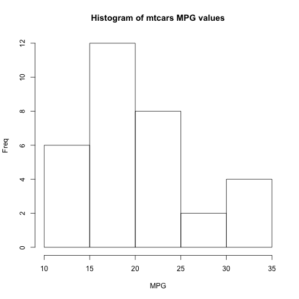

## 1 - Introduction
There is an acute, global focus on emissions and efficiency of road vehicles.  The ability to assess the likely efficiency of a road vehicle before purchase is a valuable service to avail of.  This data product provides such a service.

The data produt:
* Is easy to use, accessible via any browser over the web
* Collects four variables to estimate the likely MPG
* Returns a precise MPG value based on a linear regression model


--- .class #id 

## 2 - Source Dataset

This data product uses a linear regression model which was built using the mtcars dataset.  The dataset contined 32 observations with 11 variables.  Range MPG values is displayed below. 

 

---

## 3 - Linear Regression Model
A stepwise-selected model was generated using the step function, which was able to start with the full model, containing all variables and refine this down to four variables and coefficients shown below.


```
## 
## Call:
## lm(formula = mpg ~ cyl + hp + wt + am, data = mtcarscopy)
## 
## Coefficients:
## (Intercept)         cyl6         cyl8           hp           wt  
##    33.70832     -3.03134     -2.16368     -0.03211     -2.49683  
##    amManual  
##     1.80921
```

---

## 4 - Model Accuracy
From an accuracy perspective, the created model caters for just over 84% of the variance in the data, as shown below.


```r
    summary(best_model)[8]
```

```
## $r.squared
## [1] 0.8658799
```

```r
    summary(best_model)[9]
```

```
## $adj.r.squared
## [1] 0.8400875
```

---

## 5 - Getting Started 
You can start using the MPG Prediction Data Product by following this [link](https://darraghmcconville.shinyapps.io/dss_dev_data_products).

You can find the source code for the MPG Prediction Data Product at this [link](https://github.com/dmc1899/dss_dev_data_products).
